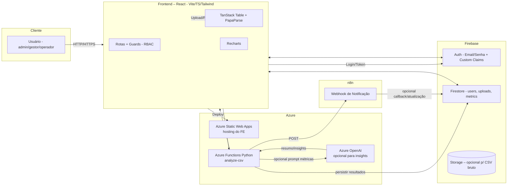
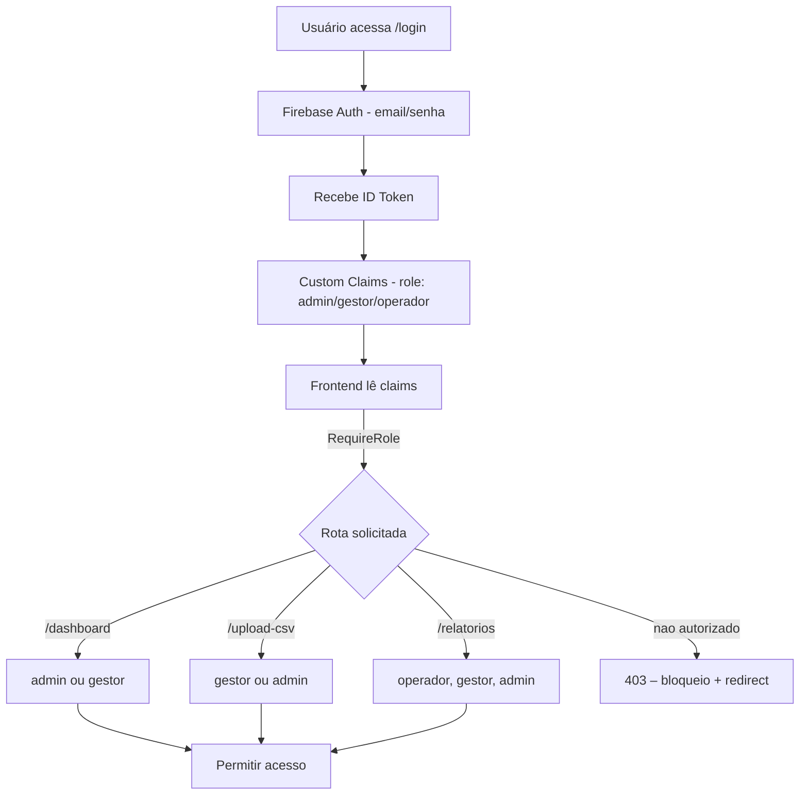
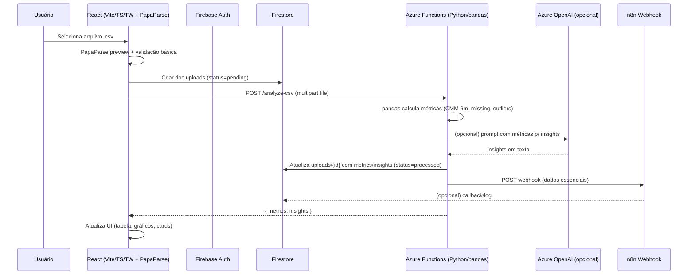
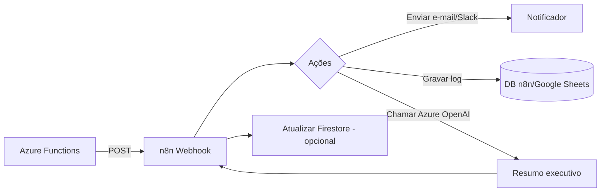
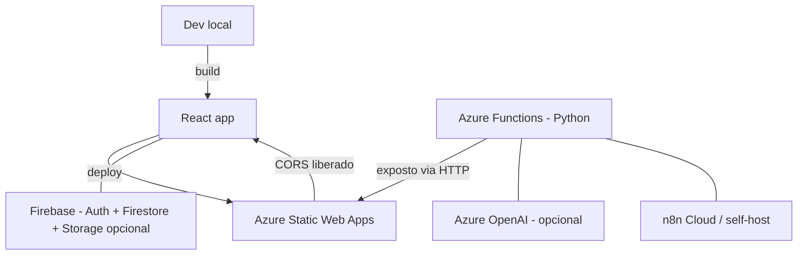
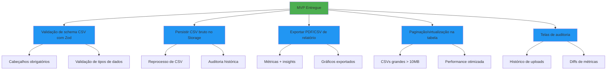
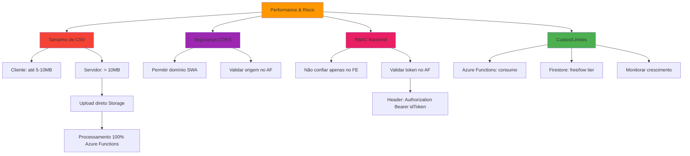
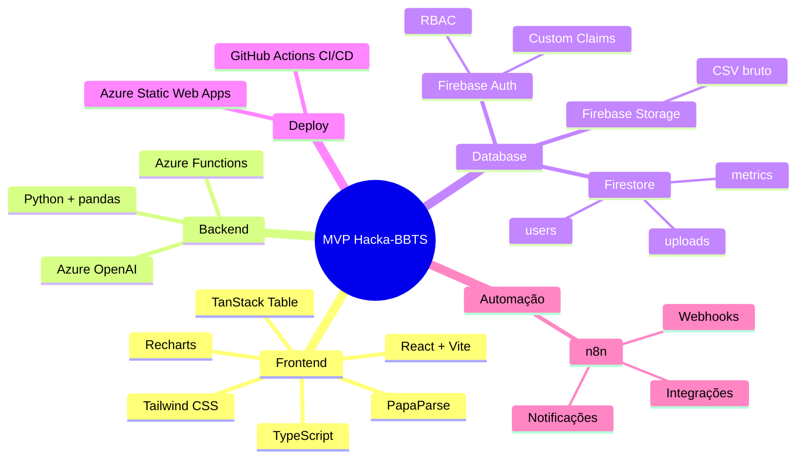

# MVP – Fluxos e Arquitetura

Abaixo estão os fluxos essenciais para visualizar toda a arquitetura do MVP proposto (Frontend React + Firebase Auth/Firestore, Azure Static Web Apps + Azure Functions Python, n8n e Azure OpenAI opcional).

---

## 1) Visão geral (Contexto do Sistema)



> **Pontos-chave:**
>
> - **RBAC** com Custom Claims no Firebase Auth; guards nas rotas do FE.
> - **CSV**: preview e métricas rápidas no client (PapaParse) + análise robusta no **Azure Functions (pandas)**.
> - **Persistência**: Firestore armazena uploads, status e métricas; Storage opcional para o CSV bruto.
> - **Azure** obrigatório atendido via **Static Web Apps + Functions** e, se desejar, **Azure OpenAI** para insights.
> - **n8n** recebe webhook pós-processamento e dispara notificações/rotinas.

---

## 2) Fluxo de Autenticação e RBAC



**Coleções/estruturas (exemplo):**

- `users/{uid}` → `{ role, name, email, createdAt }`
- `uploads/{id}` → `{ ownerUid, status: 'pending'|'processed'|'error', metrics, insights, createdAt }`

---

## 3) Fluxo de Upload e Análise de CSV



**Métricas sugeridas (exemplo):**

- `rows`, `columns`, `missingRatio` global e por coluna
- `cmmBySku` (média últimos 6 meses por SKU)
- `leadTimeDaysAvg` (se houver datas de pedido/entrega)
- `anomalies` (quebras de padrão, negativos, datas inválidas)

---

## 4) Fluxo de Notificações/Automação (n8n)



**Gatilhos comuns:**

- Novo upload processado
- Erro na análise
- Anomalias acima de um limiar

---

## 5) Diagrama de Deploy & Integração



**.env (exemplo mínimo do FE):**

```
VITE_FIREBASE_API_KEY=
VITE_FIREBASE_AUTH_DOMAIN=
VITE_FIREBASE_PROJECT_ID=
VITE_AZURE_FN_URL=https://<seu-app>.azurewebsites.net/api
VITE_N8N_WEBHOOK=https://n8n.example.com/webhook/notify
```

---

## 6) Backlog pós-MVP (rápidos wins)



- Validação de schema de CSV (cabeçalhos obrigatórios) com Zod.
- Persistir CSV bruto no Storage (para reprocesso/auditoria).
- Exportar PDF/CSV de relatório (metrics + insights + gráficos).
- Paginação/virtualização na tabela para CSVs grandes.
- Telas de auditoria: histórico de uploads e diffs de métricas.

---

## 7) Observações de Performance e Risco (resumo)



- **Tamanho de CSV no client:** para >5–10MB, considere streaming/chunk e/ou upload direto para Storage + processamento 100% no AF.
- **CORS:** garantir domínio do SWA permitido no AF.
- **RBAC:** não confiar só no FE; validar role no AF (verificar token Firebase no header `Authorization: Bearer <idToken>`).
- **Custos/limites:** Azure Functions em consumo + Firestore free/low tier cobrem MVP.

---

## 8) Resumo Visual - Tecnologias Utilizadas


